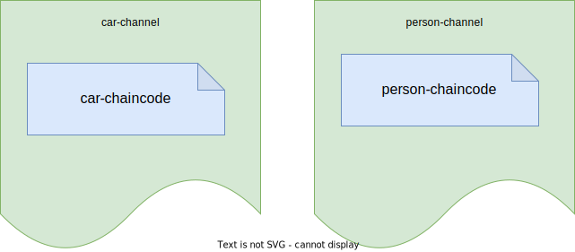

# Car lifes cicle network

### Vehicle Management System using Hyperledger Fabric

## Structure of channel and chaincode

## UML of chaincodes

## Entities

## How to run?

1 - Run the Hyperledger network: `fablo up`
