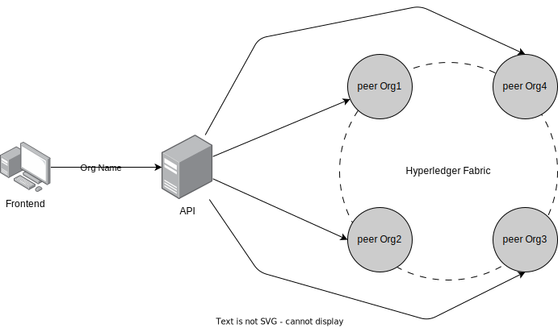

# Car lifes cicle network
<p align="center">

</p>

<p align="center">
Vehicle Management System using <a href="https://hyperledger-fabric.readthedocs.io/en/latest/">Hyperledger Fabric</a>
</p>

- Blockchain: Hyperledger Fabric
- API: Typescript Express
- Frontend: React with MaterialUI

<hr />

## 🗄️ Docs

- [Hyperledger configuration](/docs/HYPERLEDGER-CONFIG.md)
- [Performance Results](/docs/PERFORMANCE-RESULT.md)
- [Commands Makefile](/docs/COMMANDS_MAKEFILE.md)

<hr />

## 🩻 Arquiteture



<hr />

## 🗂️ Structure of project

**Hyperledger**: `fablo-config.json` and `/fablo-target`that will be generated
- This is blockchain

**Chaincodes**: `/chaincodes`
- This is smart contracts that will be installed in blockchain

**API**: `/zeus-middleware-api`
- This is API that used to communicate in between Frontend and smart contracts inside blockchain

**Frontend**: `/atena-frontend`
- This is interface used to interact with blockchain

**Mechanic-CLI**: `/mechanic-cli`
- This is CLI to simulate a different system using blockchain (Not use API to run transactions)

**Scripts**: `/scripts`
- This is scripts used to populate base and run performance tests

<hr />

## 🥇 How to run:

### 🔖 Requirements

- Docker and docker-compose
- +Python3.7 
- Node 12.x and npm

### 🛠 Run blockchain Hyperledger Fabric

- Configure fablo enviroment `make configure-fablo`

- Generate the fablo-target with `fablo generate`

- Edit file `fablo-target/fabric-config/configtx.yaml` in `Application: &ApplicationDefaults` (use `ctrl+f` to localize) and replace Policies->Endorsement->Rule to `MAJORITY Endorsement` to `ANY Writers`

In this section:
```
    Policies:
    ...
        Endorsement:
            Type: ImplicitMeta
            Rule: "MAJORITY Endorsement"
```
Replace for this:
```
        Endorsement:
            Type: ImplicitMeta
            Rule: "ANY Writers"
```

- Run blockchain `fablo up`, the chaincodes will be installed automatically

- For help: `fablo help`

- For access Hyperledger Explorer, find the docker with name `explorer.example.com` and go to url, nomally is `http://localhost:7010` and user is `admin` and password is `adminpw` for all orgs

### 🛠 Generate env files for API, Mechanic CLI and Scripts

- Run `python build_env_files.py`

### 🛠 Run API Typescript Express

✏️ Notes:
- You need generate env files before run API

**🐳 Run in docker**

- Only run `make run-api-docker` and if can stop `make stop-api-docker`

- API will be exposed in port 3000

**💻 Run in machine**

- Entry is folder `cd zeus-middleware-api/`

- Run `npm i` to install dependencies

- Run `npm run dev` to start API in development mode

- API will be exposed in port 3000

### 🛠 Run Frontend React with MaterialUI

✏️ Notes:
- The `URL_BASE` configure in file `/atena-frontend/src/shared/environment/index.ts`, default is `https://localhost:3000`

**🐳 Run in docker**

- Only run `make run-frontend-docker` and if can stop `make stop-frontend-docker`

- Frontend will be exposed in port 3006

**💻 Run in machine**

- Entry is folder `cd atena-frontend/`

- Run `yarn` to install dependencies

- Run `npm run start` to start frontend

- Frontend will be exposed in port 3006

### 🛠 Run Mechanic CLI

✏️ Notes:
- You need generate env files before run API

**💻 Run CLI**
- Entry is folder `cd mechanic-cli-typescript/`

- Run `npm i` to install dependencies

- To start run `npm run start`

### 🛠 Run Scripts

✏️ Notes:
- You need generate env files before run API

**💻 Run Scripts CLI**
- Entry is folder `cd scripts/`

- Run `npm i` to install dependencies

- To start run `npm run start`
