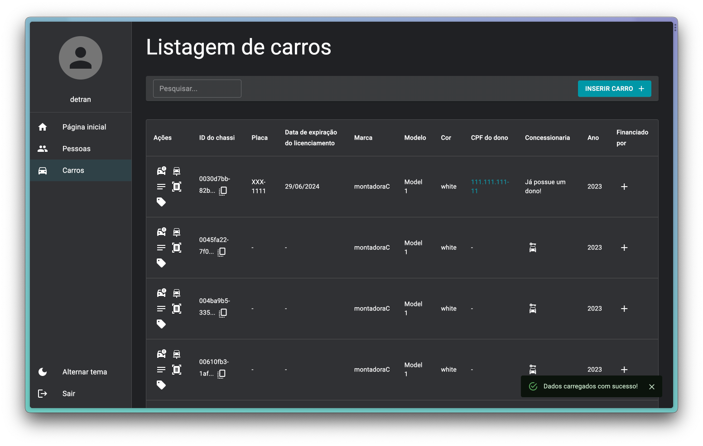
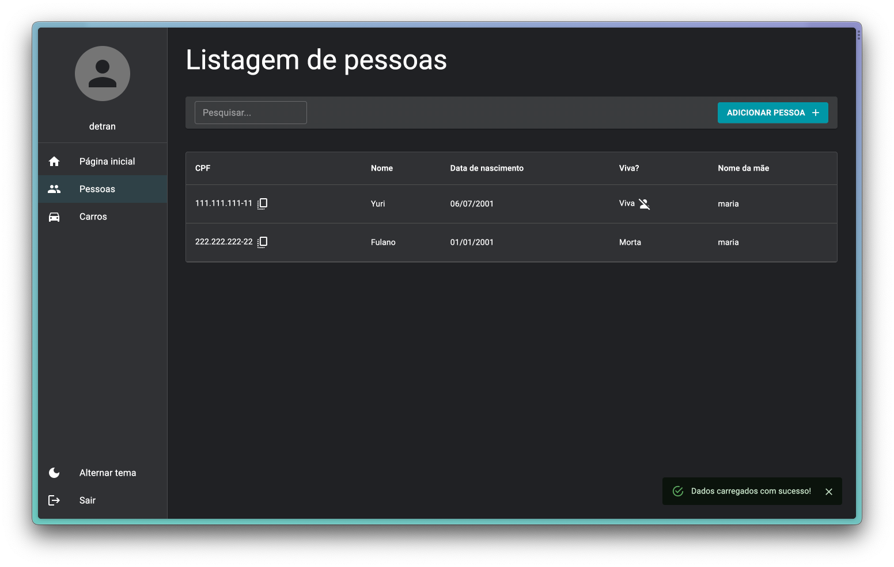
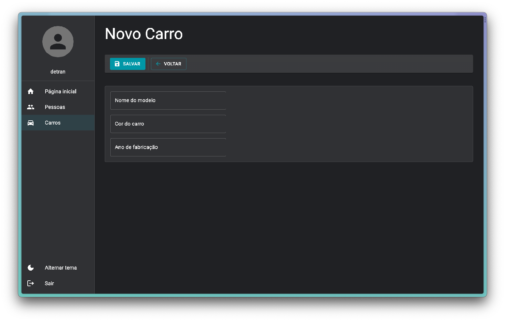
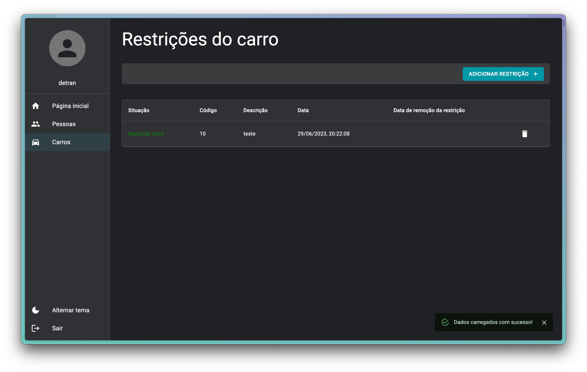
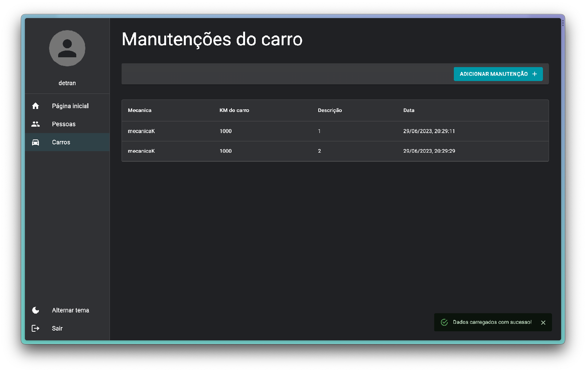
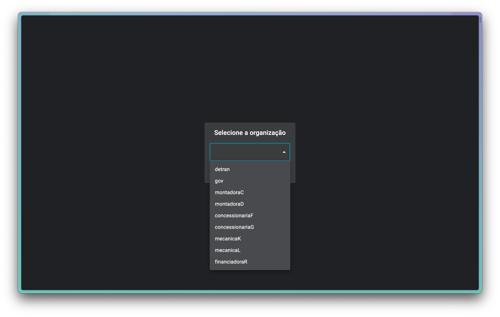

# 📷 Frontend Prints

🔹 All prints in `docs/images/prints`

    <h1 align="center">Homepage</h2>
    

    <h1 align="center">List Cars</h2>
    

    <h1 align="center">List People</h2>
    

    <h1 align="center">New Car</h2>
    

    <h1 align="center">Car Restrictions</h2>
    

    <h1 align="center">Car Maintenances</h2>
    

    <h1 align="center">Login</h2>
    

